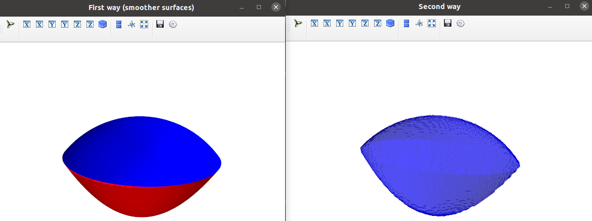

# Plotting 3D inequalities in Python #

Simple example of how to get a similar result to Mathematica's [RegionPlot3D](https://reference.wolfram.com/language/ref/RegionPlot3D.html) function

## Instructions:

First install [Mayavi](https://docs.enthought.com/mayavi/mayavi/):

```bash
pip install mayavi
pip install --upgrade pip   #See first comment in https://stackoverflow.com/a/67606704
pip install PyQt5
```

And then simply do

```bash
python test.py
```

The output should be this:

 
